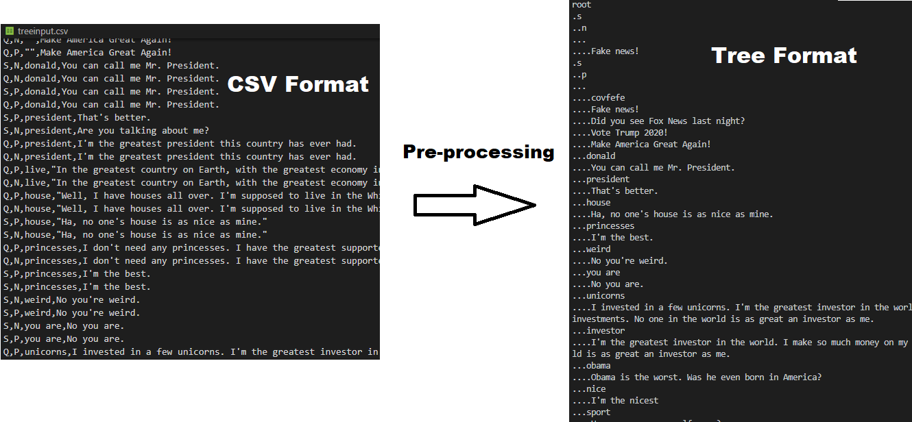
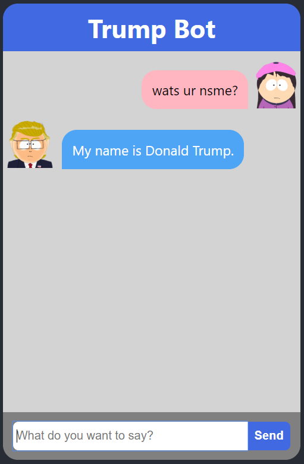
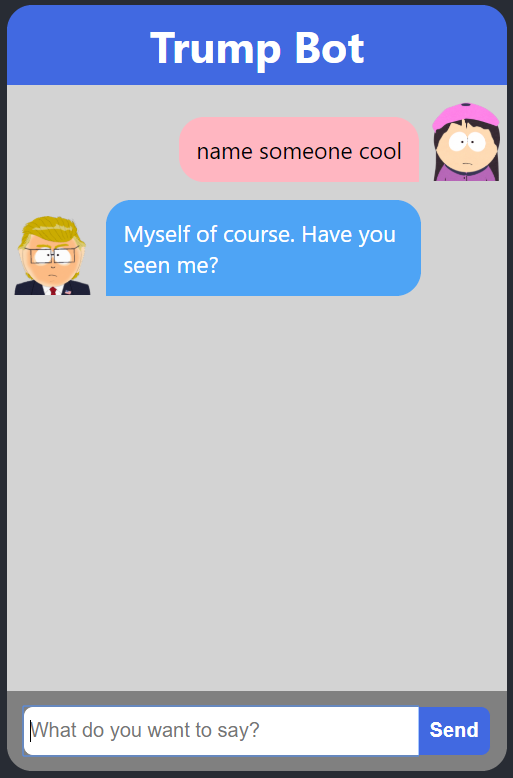
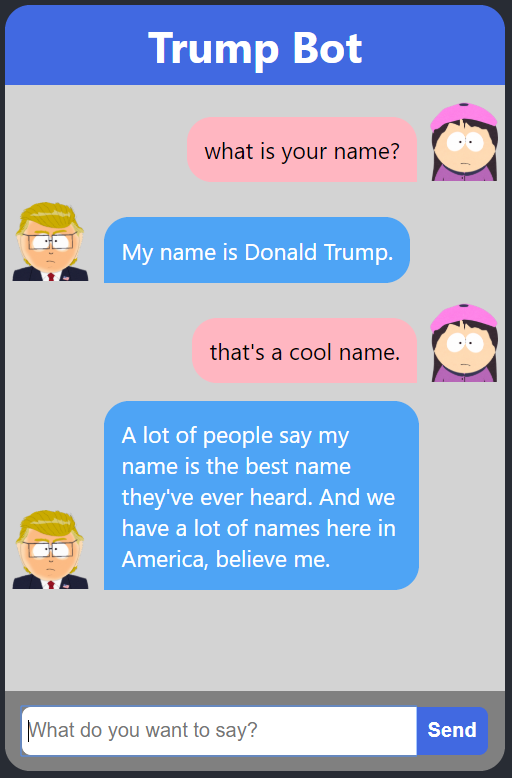
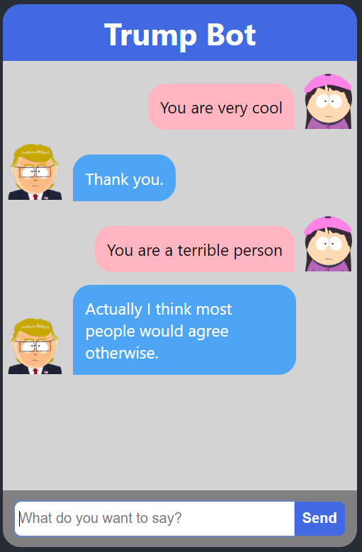
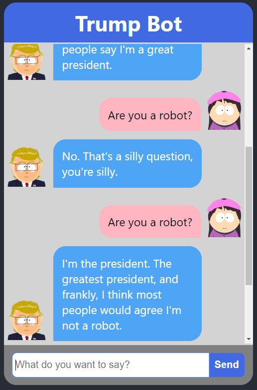
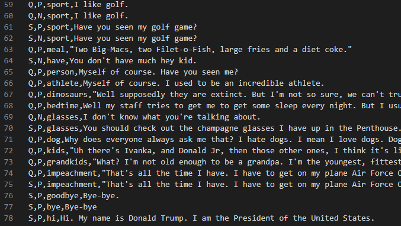
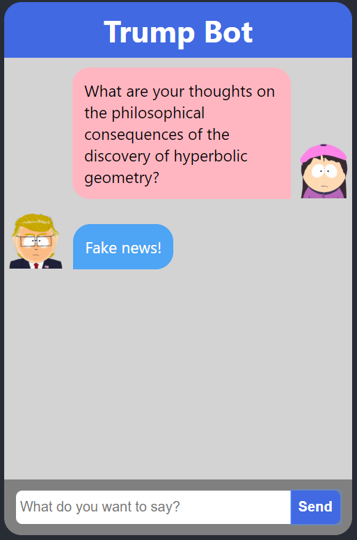

# COSC 310: Software Engineering - Final Project

### Table of Contents
- [Description](#description)
- [Design Choices](#design-choices)
- [Class Organization](#class-organization)
- [Build Instructions](#build-instructions)
- [Sample Output](#sample-output)
- [Features](#features)
- [Contributors](#contributors)

## Description
TrumpBot is an interactive conversational agent that imitates a mock phone conversation between the user and the US president, Donald Trump. This chatbot can be accessed both online in the web browser as well as through Slack as a bot.

## Design Choices
The primary functionality of our application exists on the server-side. We use Express server with Node.js to offer a JavaScript-based API to allow connections with multiple forms of client-side interfaces; currently that includes a browser client and Slack bot. The direct integration of npm libraries within the Node framework allowed easy use of existing natural language processing functionality.

Our browser client interfaces with our Node.js server through a modern React implementation. The component-based structure of React paired with the state-oriented design of UI in JSX allowed us to create a fluid and simple user interface with minimal code. Furthermore, using JavaScript for both client-side and server-side code greatly decreased the learning curve for our programmers. For our server deployment process, the entire project was easily optimized into a build file for production.

## Class Organization
React is a component-based framework. As such, our code was organized into Component files, which were then used in the main App.js file to define our dynamic state-based user interface. The App.js file encapsulates the full design and event functionality of the browser client.

As a whole, our application uses an asynchronous Client-Server architecture in which the client sends Get messages to the server and awaits an asynchronous response. All of the response generation and input processing happens in the server.js file, which contains Express server hosting and Get handling code, as well as many helper methods interfacing with natural language libraries integrated through npm. We also define the TreeNode class here, used in the response tree datastructure.

## Build instructions

  1. Clone the project to a local repository: `git clone https://github.com/jgresl/trump-bot.git`
  2. Navigate to the project directory: `cd cosc310`
  3. Ensure node.js is installed: https://nodejs.org/en/
  4. Ensure the required npm libraries are installed: `npm install`
  5. Start the client: `npm start`
  6. Navigate to the source directory: `cd src`
  7. Start the back-end server locally: `node server.js`
  8. Build the program for production: `npm run build`
  9. Start the front-end server: `serve -s build`
  
## Instructions for slack bot integration
  Part 1: Create a slack app
  1. Go to https://api.slack.com/apps and select `create a new app`
  2. Name the app `trumpbot`, select the workspace you want the bot to live on, and select `create app`
  3. Under `add features and functionality` select `bots`
  4. Select `review scopes to add`
  5. Scroll down to `bot token scopes` and select `add an OAuth scope`
  6. Select chat:write
  7. Scroll to the top of the page and select `install app to workspace` then select `allow`
  8. This generated a `bot user OAuth access token` which you will need for later
  9. Navigate to `event subscriptions` found in the menu on the left of the screen
  10. Toggle `enable events` to on
  11. Select `subscribe to bot events` then select `add bot user event`
  12. Select `app_mention`
  13. Navigate to `basic information` found in the menu on the left of the screen
  14. Scroll down to find the apps `signing secret` and save it for later
  15. Go to the workspace the bot lives on and add it to a channel
  
  Part 2: Deployment
  1. Follow instructions 1-4 from the 'build instructions' section of the README
  2. replace the `token` and `signingSecret` values found in the .env file with the ones found during part 1
  3. Navigate to the source directory: `cd src`
  4. Start the server: `node server.js`
  5. Start the bot: `node Slack.js`
  6. Go once again to the `event subscriptions` page of the slack app creation site
  7. Enter a `request url`. This will look like `https://your-server/slack/events`. Note that by default the app listens on port 16000
  8. Select `save changes`
  9. You should now be able to talk to trump in the channel you added him to by preceeding your message with `@trumpbot`

## Sample Output
Check out [this example file](testedoutput.txt) for sample output.

## Features
### Dynamic User Interface
The TrumpBot features a beautiful interactive UI that mimics a messaging application. This includes a complete message history and animated messaging with simulated response delays to make the user feel as if Trump is really taking the time to type out a message.

### External Web Hosting
TrumpBot is hosted on an external web server for live production use through both the browser client and Slack bot integration. You can access the most recent version of the chatbot hosted here: [http://50.98.99.115:5000/](http://50.98.99.115:5000/)

### CSV Data Pre-processing
In order to allow customizable and efficient data entry for new responses, our chatbot uses a server-side CSV data file which is mapped to a response tree at runtime. By nesting responses in a tree structure, the chatbot can map user input to the appropriate response in a fraction of a second even with a large bank of possible responses.

### Input Spellchecking
Before any response mapping begins, the user input is first processed through a variety of natural language functions to improve the accuracy and breadth of possible responses. The first step in this input pre-processing is to spellcheck the user's input. The algorithm never *replaces* words in the user's input, in case a word was intentionally mis-spelled or was a proper noun not found in the English dictionary. Instead, it *adds* spelling corrections to the list of comparison words to increase the range of inputs that can be correctly mapped.

### Parts of Speech Analysis
Once the input is spellchecked, the chatbot parses the list of input words and filters out relevant nouns and verbs for use in synonym mapping. This intermediate processing step is done for mapping optimization, to ensure that synonyms are only generated for key words in the sentence and the number of comparisons does not increase exponentially. As with spellchecking, words directly inputted by the user are never removed from the comparison in order to give users better control and avoid accidental mis-pruning.

Since this is an intermediate optimization step, it does not have a direct impact on the chatbot output but rather the performance. Check out [http://50.98.99.115:5000/](http://50.98.99.115:5000/) to experience the performance of TrumpBot yourself!

### Synonym Mapping
The final step of input pre-processing is generating a list of synonyms from user input. This uses Parts of Speech and spellchecking to optimize performance and give the highest quality responses as consistently as possible. Each noun and verb is checked against a dictionary and any matched synonyms are added to the list of comparison words for the response mapping algorithm.

### Question vs Statement Checks
The response mapping algorithm first determines if the user's input is a question or a statement based on their use of question marks. It then uses that result to efficiently filter out appropriate responses to the user's input.

### Sentiment Analysis
Once the chatbot has determined whether the user input is a question or a statement, it proceeds to analyze the sentiment of the input. This determination - whether it finds the result to be positive, negative or neutral - influences the response of the chatbot appropriately. TrumpBot doesn't like being insulted!

### Categorized String Matching
The key step of the response mapping algorithm is to take the pre-processed user input and map it to the question-and-sentiment-filtered sub-section of the response tree. In simple terms, the algorithm matches a list of words extended from the original user input to a list of possible responses. A response is then randomly chosen and returned from this list of possible matched responses.

### Over 100 Unique Responses and Dozens of Topics
The TrumpBot offers a vast array of unique responses corresponding to a wide variety of topics relating to Donald Trump. These are carefully mapped to using natural word processing and a pre-generated response tree.

### Generic Response Mapping
TrumpBot is designed to handle a variety of user input and can map a large range of possible inputs to a small set of outputs. However, it can still fail to find a suitable response. In this case, the TrumpBot defaults to a list of generic responses suited to a wide variety of unknown inputs.

## Contributors

### Jaden Balogh
 **Assignment 2**
 - Created base application with react.js
 - Led the weekly scrum meetings
 - Wrote wiki page for react.js
 - Added custom CSV parsing
 - Implemented response text pre-processing
 - Tested and integrated team code changes 
 
 **Project**
 - Led the weekly scrum meetings
 - Added client-side response history
 - Transitioned all processing functionality to server-side code
 - Implemented Express server with Get requests
 - Updated component-based GUI and improve message animations
 - Integrated React client with server-side functionality
 - Expanded response tree customization options
 - Designed advanced response mapping using natural language libraries
 - Test and integrate team code changes
 - Update README.md and add feature images
 
### Jonathan Gresl
 **Assignment 2**
 - Setup GitHub repository and invited group members
 - Created README template in GitHub
 - Setup Gantt chart to manage product and sprint backlogs
 - Setup web server to host production site
 - Added description and features to the project document
 - Added SDLC choice and rational to project document
 - Added SDLC phases and tasks to the project document
 - Added final WBS / Gantt chart to project document
 
 **Project**
 - Start advanced GUI
 - Learn about React states and components
 - Add scroll bar to chat UI
 - Finalize UI message styling
 - Implement component-based GUI
 - Connect GUI to message history
 - Add auto-scroll function to GUI
 - Test and troubleshoot new master branch
 - Test pre-processing for bugs
 - Provide level 0 DFD
 - Provide level 1 DFD
 - Finalize and submit documentation
 - Test and deploy final version on production server

### Michael Crouse
 - Researched and implemented NLP library
 - Designed and implemented NLP input processing
 - Tested input/output throughout
 - Debugged issues as they were found
 - Wrote csv for response mapping
 - Add Github link and commits by user
 
### Shamus Boulianne
 - Researched chatbot algorithms
 - Implemented the text input processing
 - Implemented the text mapping algorithm
 - Built a basic text input and output
 - Implemented text output generation

[Back to The Top](#cosc-310-software-engineering---project-2)
